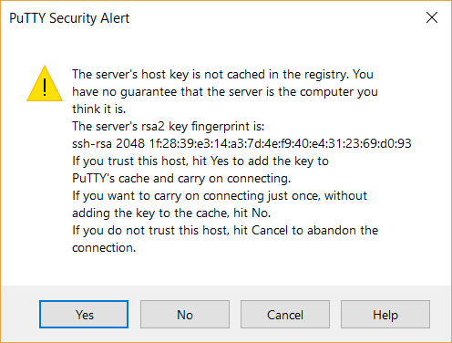
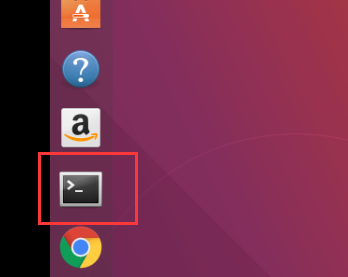
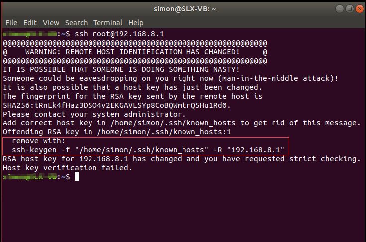

Edit files and execute command
===

In order to set up ss server, you need to have basic tools to ssh to the server.
This guide is how to SSH login to the GL routers.

# Windows User:

## 1. Download and install a PuTTY for windows user:

Go to the following webpage to download the latest PuTTY version：  

https://www.chiark.greenend.org.uk/~sgtatham/putty/latest.html

## 2. Install PuTTY for windows step by step

 

 

 

 

## 3. Launch PuTTY in Windows

Click **PuTTY** in Start Menu 

 

You will see the following Configuration Window: 

 

**Input** Host Name (or IP address) "**192.168.8.1**", Keep Port as default "**22**", select connection type: "**SSH**",

**Input** "**your session**" in saved sessions, click **<u>S</u>ave** at right side.

  

**Click "<u>O</u>pen"** at the bottom

 

A security alert will pop-up, click "**Yes**".

login as：`root`

Then input your password as following: 

root@192.168.8.1‘s password: **You need to use your password which you set up the router at the first time**

  

When you see above picture, that means you are now ssh login the router successfully.  

# Ubuntu User:

 

Click "**Terminal**"

Input the following command: 

`SSH root@192.168.8.1` 

If you have ever connected to another router, host key verification failed may displayed as follow:

 

input the red highlight command:

`ssh-keygen -f "/home/username/.ssh/known_hosts" -R "192.168.8.1"`

  

you will see the known_hosts updated. 

retry the ssh login command: 

` ssh root@192.168.8.1` 

  

Type "**yes**"

  	

Input your router password: (you can set this password when you first connect to your router)

 

Finally, you login the router when the above message displayed. 