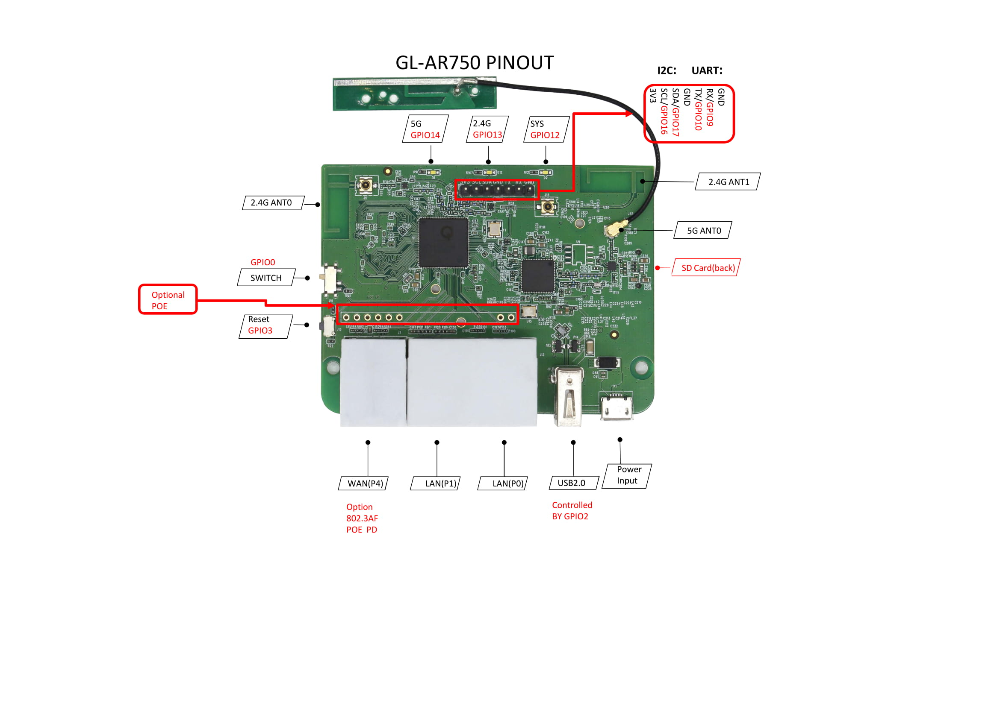

#  GL-AR750 Travel AC Router

## Hardware Specification

|                         Model | GL-AR750                                 |
| ----------------------------: | :--------------------------------------- |
|                           CPU | QCA9531 650MHz                           |
|                        Memory | DDRII 128Mb                              |
|                       Storage | 16Mb Nor Flash                           |
|                    Interfaces | 1 WAN (100Mbps), 2 LANs (100Mbps), 1 USB2.0, 1 Micro USB (power), 1 Reset Button, UART, TF Card Slot (128Gb Max.) |
|                     Frequency | 2.4GHz, 5GHz                             |
|             Transmission Rate | 300Mbps (2.4GHz) + 433Mbps (5GHz)        |
|                 Max. Tx Power | 20dBm (2.4GHz)/20dBm(5GHz)               |
|                      Protocol | 802.11 b/g/n/ac                          |
| External Drive Format Support | FAT32/NTFS/exFAT/EXT4/EXT3/EXT2          |
|                Webcam Support | MJPEG, YUV                               |
|                  DIY Features | UART, GPIO, 3.3V & 5V power port         |
|      External Antenna Support | No                                       |
|            PoE Module Support | Yes                                      |
|                   Power Input | 5V/2A                                    |
|             Power Consumption | <6W                                      |
|             Dimension, Weight | 88mmX68mmX24mm, 66g                      |

## PCB Pinout

 

