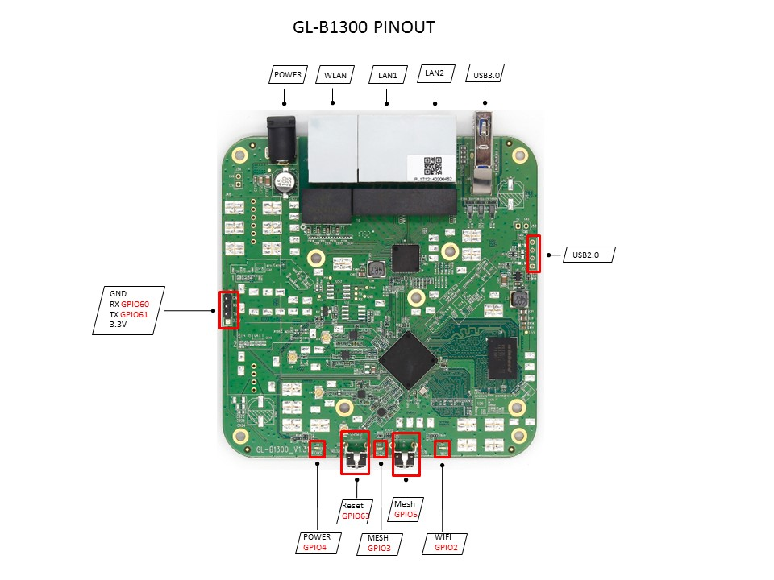

# GL-B1300 Home AC Router

## Hardware Specification

|                         Model | GL-B1300                                 |
| ----------------------------: | :--------------------------------------- |
|                           CPU | Atheros IPQ4028, Quad-core ARM,717MHz    |
|                        Memory | DDR3L 256Mb                              |
|                       Storage | 32Mb Nor Flash                           |
|                    Interfaces | 1 WAN, 2 LANs 1 USB3.0, 1 Reset Button, 1 Mesh Button |
|                     Frequency | 2.4GHz / 5GHz                            |
|             Transmission Rate | 400Mbps(2.4GHz) + 867Mbps(5GHz)          |
|                 Max. Tx Power | 20dBm                                    |
|                      Protocol | 802.11 a/b/g/n/ac                        |
| External Drive Format Support | FAT32/NTFS/exFAT/EXT4/EXT3/EXT2          |
|                Webcam Support | MJPEG, YUV                               |
|                 Ethernet Port | 10/100/1000M                             |
|                   Power Input | 12V/1.5A                                 |
|             Power Consumption | <7W                                      |
|             Dimension, Weight | 116mmX116mmX37mm, 270g                   |

##2. PCB Pinout

 

   

