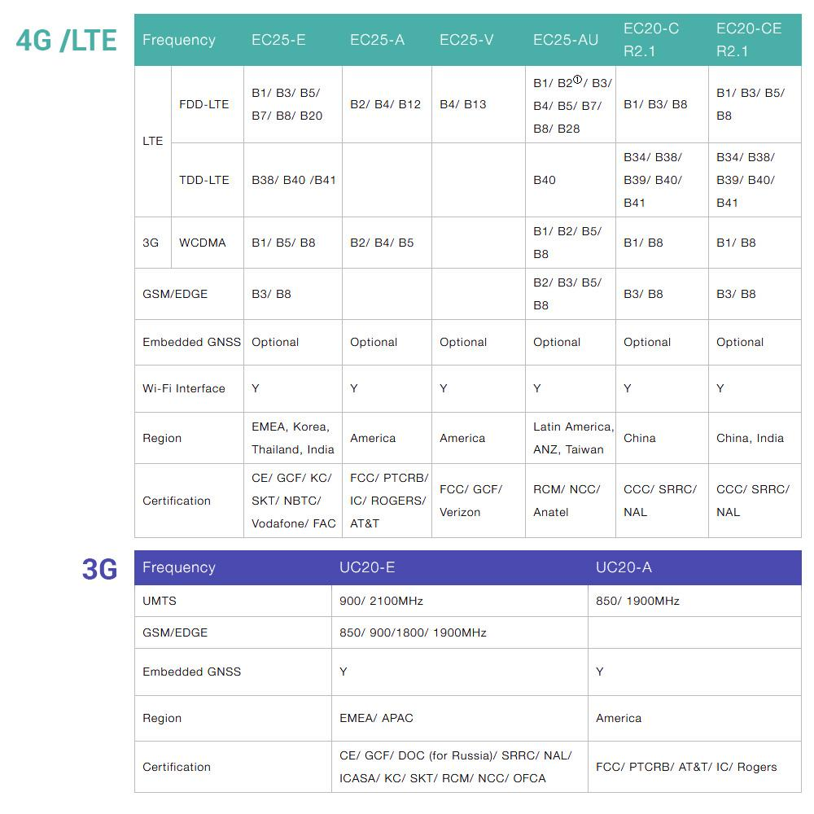

# 	GL-MiFi

##  Hardware Specification

|                         Model | GL-MiFi                                  |
| ----------------------------: | :--------------------------------------- |
|                           CPU | Atheros AR9331, @400MHz                  |
|                        Memory | DDRII 64Mb                               |
|                       Storage | 16Mb Nor Flash                           |
|                    Interfaces | 1 WAN, 1LAN 1 USB2.0, 1 Micro USB (power), Micro SIM Card Slot, TF Card Slot(128Gb Max.), 1 Reset Button, 1 On/Off Switch |
|                     Frequency | 2.4GHz                                   |
|             Transmission Rate | 300Mbps                                  |
|                 Max. Tx Power | 18dBm                                    |
|                      Protocol | 802.11 b/g/n                             |
| External Drive Format Support | FAT32/NTFS/exFAT/EXT4/EXT3/EXT2          |
|                Webcam Support | MJPEG, YUV                               |
|                  DIY Features | UART, GPIO, 3.3V & 5V power port         |
|      External Antenna Support | Yes                                      |
|          3G/4G Module Support | 3G/4G LTE (Mini PCIe Modem)              |
|                   Power Input | 5V/2A, Built-in Battery (5000mAh, Optional) |
|             Power Consumption | <3W                                      |
|             Dimension, Weight | 105mmX72mmX27mm, 170g                    |

## PCB Pinout

##  PCIe Modem Module List

   

##  Modem Manager

Please refer to [modem manager page](/setup/modem_manager.md) 

