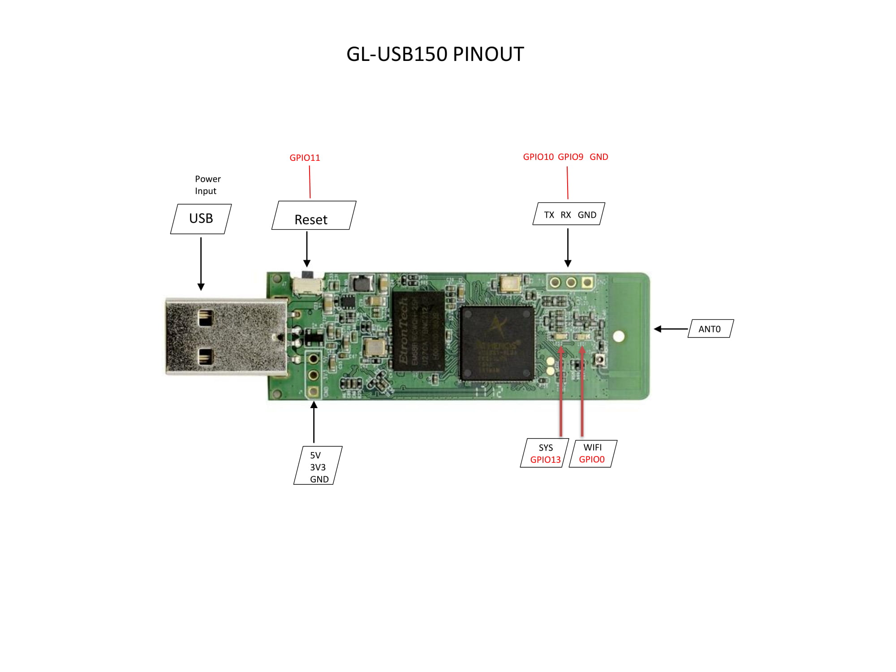

# GL-USB150 Microuter

## Hardware Specification

|             Model | GL-USB150               |
| ----------------: | :---------------------- |
|               CPU | QCA 9331, 400MHz        |
|            Memory | DDRII 64Mb              |
|           Storage | 16Mb Nor Flash          |
|         Frequency | 2.4GHz                  |
| Transmission Rate | 150Mbps                 |
|     Max. Tx Power | 20dBm                   |
|          Protocol | 802.11 b/g/n            |
|       Power Input | 5V/1A, USB Power Supply |
| Power Consumption | <1W                     |
| Dimension, Weight | 84mmX24mmX11mm, 10g     |

## PCB Pinout

 

   

