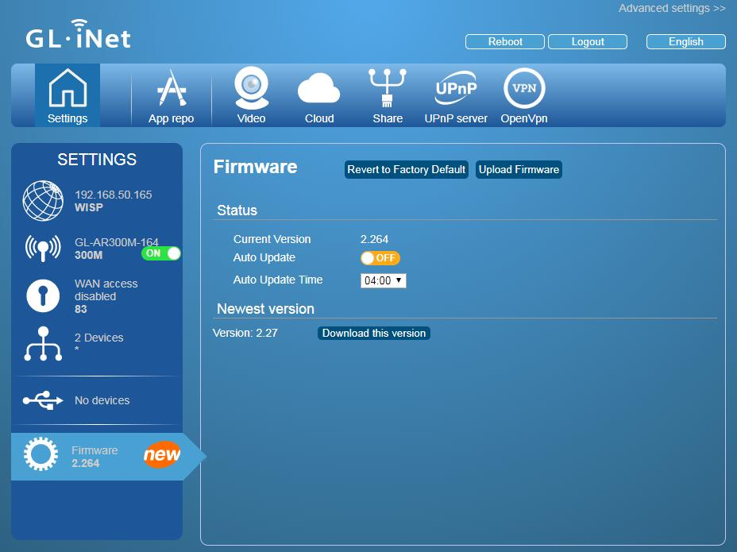

# Upgrade Firmware

The firmware is under continuous development to include new features, fix bugs and improve user experience, etc. We will release new firmware frequently. When you receive the device, you have get a GL.iNet router with an old firmware version. Please upgrade to the latest firmware immediately.

A ***new*** message will be shown when there is a new firmware available. Click the Firmware icon to check your current firmware version or perform other setting. You can enable the `Auto Update` option to upgrade automatically if it finds a newer firmware version. 

*Note: **Don't turn off** the power during upgrade. Otherwise, the router will be bricked*

## Download from the web admin page

Click `Download` to download the firmware. The downloaded file will be verified automatically. Next, you will have a `Upgrade` button to upgrade the firmware.

*Note: It is suggested to uncheck the `Keep setting`. If you keep its settings and encounter problems after the upgrade, please reset the device.*

## Upload your firmware

You can use the `Upload Firmware` button to upload the firmware file. Simply drag and drop your firmware file to the area indicated in the web admin page.

###Download from our official website

You can download the firmware file from our [website](http://www.gl-inet.com/firmware/). Moreover, we will upload       testing firmware file to the [testing](http://www.gl-inet.com/firmware/testing/) folder before official release.

###Compile your own firmware

You can compile your own firmware or use third-party firmware and upload it to the router. 

*Note: If you uploaded a wrong firmware and bricked the router, please use Uboot to re-install the correct firmware.*

#Discussions