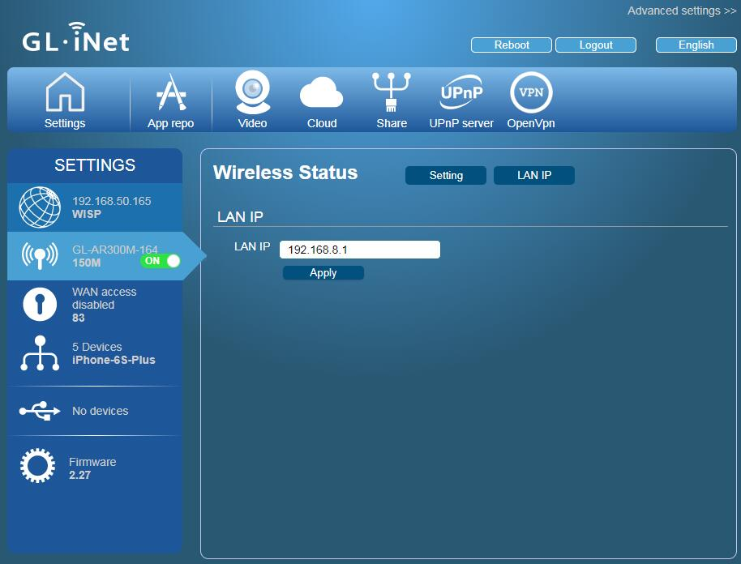

# Change LAN IP Address

The default IP address of GL.iNet router is 192.168.8.1. However, you can change the LAN IP address in the web admin page.

Most of the routers use IP `192.168.0.1`, `192.168.1,1`, `192.168.1.254`, `10.10.1.1` etc. and subnet `255.255.255.0` (`/24`). If you want to connect GL.iNet router to another network, you have to ensure they have different IP address. Otherwise, you need to change the LAN IP of GL.iNet router.

Click the wireless icon and then `LAN IP` to change the LAN IP.

#Discussions