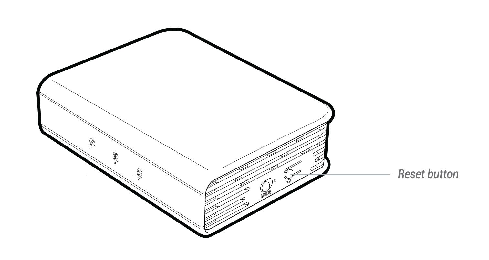

# Factory Reset

If you can neither access the web-based setup page nor the router, you can press the **reset** button:

1. Press and hold for **3 seconds** then release to repair your network.

2. Press and hold for **10 seconds** then release to reset the router to factory settings. All user data will be cleared.

   ## Mini Router

   

   ## GL-USB150 Microuter

   

   ##GL-MiFi 4G Smart Router

   

   ## GL-AR750 Travel AC Router

   

   ## GL-B1300 Home AC Router

   